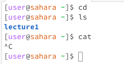

**Lab Report 1**
---

1. Share an example of using the command with no arguments.
  * `cd`: Running this command doesn't do anything because there is no argument. If there was a directory, runnning the command `cd` alone would bring you to 
        like a home screen on a phone. If there was an argument, the `cd` command changes the directory you are in. The output isn't an error because we weren't
        in a directory in the first place, so nothing happens, no matter how many times you run the command.
  * `ls`: When running this command, it displayed "lecture1" the file name. This command stands for "list" and does exactly that. Since we are in the home directory, "lecture1" was outputted. If we were in a differnt working directory, for example in "lecture1" it would then output all the files within the directory. This would not be an error because we are getting an output.
  *  `cat`: In this case, there is no working directory when I ran this command. Usually the command `cat` is suppose to print out the contents of the argument, if the argument is valid. Without an argument, the command continues attempting to execute the command until you manually end it. To properlly use this command, you need to provide the command with a path.
    
2. Share an example of using the command with a path to a directory as an argument.
  * `cd lecture1`: When running this command, I noticed that the promt changed. Now it includes the working directory the terminal is in. The purpose of the `cd` command is the change the directory. Running the command with "lecture1" as the argument set the main working directory to "lecture1". This would not be an error because the command succesfully executed. We can see this by the change in the prompt and by running `pwd` which stands for "print working directory".
  *  `ls messages`: Running this command, it listed the files within messages becase we provided the command with "messages" as the argument. This would not be an error.
  *  `cat messages`: This command ouputted "cat: messages: Is a directory" because we gave the argument as a directory. If we were to give the argument as a file, it would output whatever is in the file. This would not be an error.

3. Share an example of using the command with a path to a file as an argument.
  * `cd messages/ja.txt`: I noticed with this command, it outputted "bash: cd: en-us.txt: No such file or directory". This is becase the `.txt` is a file and not a directory. `cd` changes the directory and since a file was given as the argument, it couldn't execute the command. I think this would be considered an error because we weren't able to execute the `cd` command. If we gave it a directory as the argument, it would be able to fully execute it and change the directory.
  * `ls messages/ja.txt`: When I ran this command, I noticed it outputted "messages/ja.txt". I think this is because the `ls` command is meant to list the directories and files within the working directory. When provided a path to a file, it's not possible to list the files and directories because there are no files/directories within a file. To output the information in a file, `cat` would be the proper command. This would not be an error.
  * `cat messages/ja.txt`; When I ran this command, it outputted the information stored in the `ja.txt` file, which was "Hello World!" in Japanese. This would not be an error because the argument in the command was a path to a file, which resulted in the command being executed.
 
