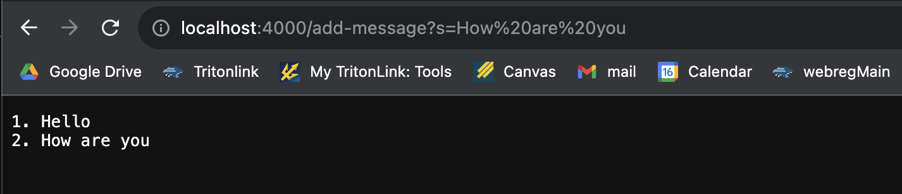
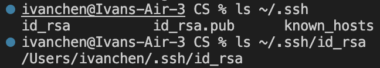
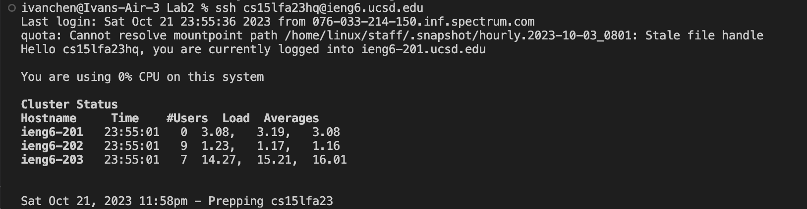

**Lab Report 2**
---
Part 1  
  
  

1. Which methods in your code are called?
  * In this image, the `handleRequest` is being called. It checks the url to see if it contains `/add`. If it does, it will continue to check for the query.
2. What are the relevant arguments to those methods, and the values of any relevant fields of the class?
  * The relevant arguments to those methods would be the `url.getPath()` which would return `/add-message` and `url.getQuery()`, which returns `s=Hello`. `int num` and `String str` would be the values of the class.
3. How do the values of any relevant fields of the class change from this specific request? If no values got changed, explain why.
  * It checks if the url path contains `/add`, if it doesn't have it, it returns a `404 Not Found` error. Then it splits the query string at the `=` and checks if the first element of `parameters` is `s`. Then it will increment `num` and use that new vaule and append `Hello` to `str`. Lastly, it will return `str`.

  

1. Which methods in your code are called?
   * Similar to the first one, the `handeRequest` method is being called.
2. What are the relevant arguments to those methods, and the values of any relevant fields of the class?
   * The relevent arguments are `url.getPath()` which would return `/add-message` and `url.getQuery()`, which returns `s=How are you`. `int num` and `String str` would be the values of the class.
3. How do the values of any relevant fields of the class change from this specific request? If no values got changed, explain why.
   * Just like the first one, the values mentioned earlier change when it splits the query at the `=`. Then checks if the first element of `parameters` is `s`. Then it will increment `num`, using the new value and appending `How are you` to `str`. Returns `str` and outputs it.

Part 2  
Path to the Public Key:  
  
Path to Public Key:  
  
Log in without password:  

Part 3  
From the past few labs, I've learned how to be able to connect to a remote server from my own computer. It was interesting to learn how to do it on a computer from the schools lab, but it was fun to learn the steps in setting it up on my own computer. I also didn't know that you can setup `SSH` keys for easy access. It made logging into my account a lot easier, not having to retype my password multiple times.
