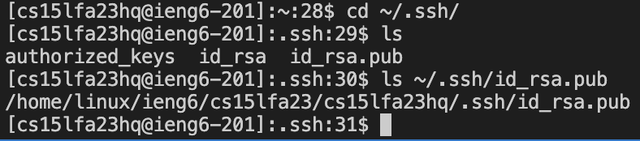

**Lab Report 2**
---
Part 1  
  

Part 2  
Path to the Public Key:  
  
Path to Public Key:  
  
Log in without password:  

Part 3  
From the past few labs, I've learned how to be able to connect to a remote server from my own computer. It was interesting to learn how to do it on a computer from the schools lab, but it was fun to learn the steps in setting it up on my own computer. I also didn't know that you can setup `SSH` keys for easy access. It made logging into my account a lot easier, not having to retype my password multiple times.
