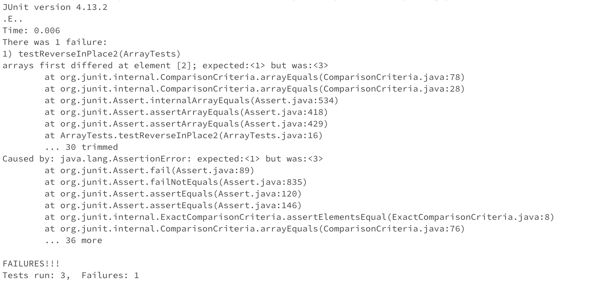
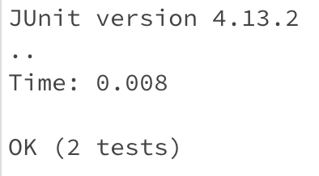

**Lab Report 3**
---
Part 1 - Bugs  
* A failure-inducing input for the buggy program, as a JUnit test and any associated code (write it as a code block in Markdown)
  ```
  @Test
  public void testReverseInPlace2() {
    int[] input1 = {1,2,3};
    ArrayExamples.reverseInPlace(input1);
    assertArrayEquals(new int[]{3,2,1}, input1);
  }
  ```  
* An input that doesn’t induce a failure, as a JUnit test and any associated code (write it as a code block in Markdown)
  ```
    @Test 
	public void testReverseInPlace() {
    int[] input1 = { 3 };
    ArrayExamples.reverseInPlace(input1);
    assertArrayEquals(new int[]{ 3 }, input1);
	}
  ```  
* The symptom, as the output of running the tests (provide it as a screenshot of running JUnit with at least the two inputs above)
  
  Failure-inducing input with an input that doesn't induce a failure  
  

  Input that doesn't induce a failure  
  

* The bug, as the before-and-after code change required to fix it (as two code blocks in Markdown)  
  Before:
  ```
    static void reverseInPlace(int[] arr) {
    for(int i = 0; i < arr.length; i += 1) {
      arr[i] = arr[arr.length - i - 1];
    }
  }
  ```
  After:
  ```
    static void reverseInPlace(int[] arr) {
    int temp = arr[0];
    for(int i = 0; i < (arr.length/2); i += 1) {
      arr[i] = arr[arr.length - i - 1];
    }
    arr[arr.length - 1] = temp;
  }
  ```
  The fix in the "After" code introduces a temporary `temp` variable which stores the value of the first element. Then it will iterate up to half of the array because of `arr.length/2` and swap the elements. It will then assign the first origanl element held in `temp` to the last element in the array.

Part 2 - Researching Commands  
`find -newer file`: 
```
ivanchen@Ivans-MacBook-Air-3 docsearch % find ./technical -newer technical/911report/chapter-2.txt
ivanchen@Ivans-MacBook-Air-3 docsearch %
```
The `-newer` option will list all the files that have a newer modification time than the file provided at the end of the command. So in the code block above, I added a few words to `chapter-1.txt` first and did the same to `chapter-2.txt` after. As you can see from the first command, it tried to find files with a newer modification time than `chapter-2.txt`, but since it was the most recently updated file, nothing was returned.
```
ivanchen@Ivans-MacBook-Air-3 docsearch % find ./technical -newer technical/911report/chapter-1.txt
technical/911report/chapter-2.txt
```  
However, in the second command, it returned the file path that had a newer modification time than `chapter-1.txt`, `chapter-2.txt`. This is useful because it can help you find which files that have been modified recently.    
https://www.computerhope.com/unix/ufind.htm  

`find -link n`:  
```
ivanchen@Ivans-MacBook-Air-3 docsearch % find ./technical/911report -links 1
./technical/911report/chapter-13.4.txt
./technical/911report/chapter-13.5.txt
./technical/911report/chapter-13.1.txt
./technical/911report/chapter-13.2.txt
./technical/911report/chapter-13.3.txt
./technical/911report/chapter-3.txt
./technical/911report/chapter-2.txt
./technical/911report/chapter-1.txt
./technical/911report/chapter-5.txt
./technical/911report/chapter-6.txt
./technical/911report/chapter-7.txt
./technical/911report/chapter-9.txt
./technical/911report/chapter-8.txt
./technical/911report/preface.txt
./technical/911report/chapter-12.txt
./technical/911report/chapter-10.txt
./technical/911report/chapter-11.txt
ivanchen@Ivans-MacBook-Air-3 docsearch %
```  
The `-link n` option does exactly what it sounds like. It finds the files that has `n` links. In the first code block, the command finds the files in the path `./technical/911report` that have exactly 1 link within the file. It does't output those with more than one because the command looks for files with EXACTLY one link. 
```
ivanchen@Ivans-MacBook-Air-3 docsearch % find ./technical/911report -links 2
ivanchen@Ivans-MacBook-Air-3 docsearch % 
```
 In the second, it does the same but finds the files that have exactly 2 links. Similar to the first command, it only looks for files in the path `./technical/911report` that have EXACTLY 2 links within the file. It is useful because it can help find files that have `n` amount of links.  
https://www.computerhope.com/unix/ufind.htm  

`find -empty`:  
```
ivanchen@Ivans-MacBook-Air-3 docsearch % find ./technical -empty
./technical/emptyFile.txt
./technical/911report/emptyFile2.txt
```  
This command-option looks for all the empty files in the given path. In the first command example, it finds all empty files in `./technical` and returns the path to those files.
```
ivanchen@Ivans-MacBook-Air-3 docsearch % find ./technical/911report -empty
./technical/911report/emptyFile2.txt
```
 The second find commands specificaly in `./technical/911report`. Similar to the first example, it outputs the path to `emptyFiles2.txt` only because the arguemnt it was given was `/911report`. This is useful because it can show all the useless empty files in your directory that you can get rid of.  
https://www.computerhope.com/unix/ufind.htm  

`find -amin n`:  
```
ivanchen@Ivans-MacBook-Air-3 docsearch % find ./technical -amin -20
./technical
./technical/emptyFile.txt
./technical/911report
./technical/911report/emptyFile2.txt
```
This command-option searches for files that were accessed `n` minutes ago. For example, the first command example searched `./technical` for files that were modified in the last 20 minutes. The `-20` indicates the last 20 minutes, while `+20` would look for files that were modified more than 20 minutes ago.
```
ivanchen@Ivans-MacBook-Air-3 docsearch % find ./technical/911report -amin -10
./technical/911report
./technical/911report/emptyFile2.txt
```
 The second command is similar, but it searches directly in `./technical/911report`. It returns the files that were mmodified in the last 10 minutes within `./technical/911report`. This command would be usefull because it would show all the files you have modified in the last `n` minutes.  
https://www.computerhope.com/unix/ufind.htm
